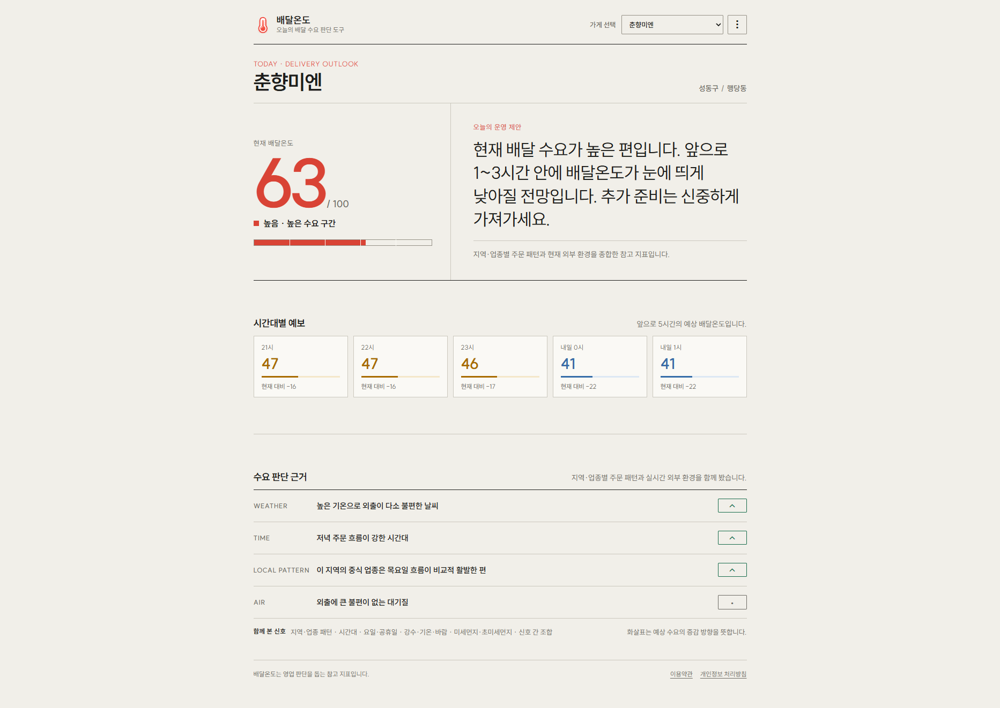
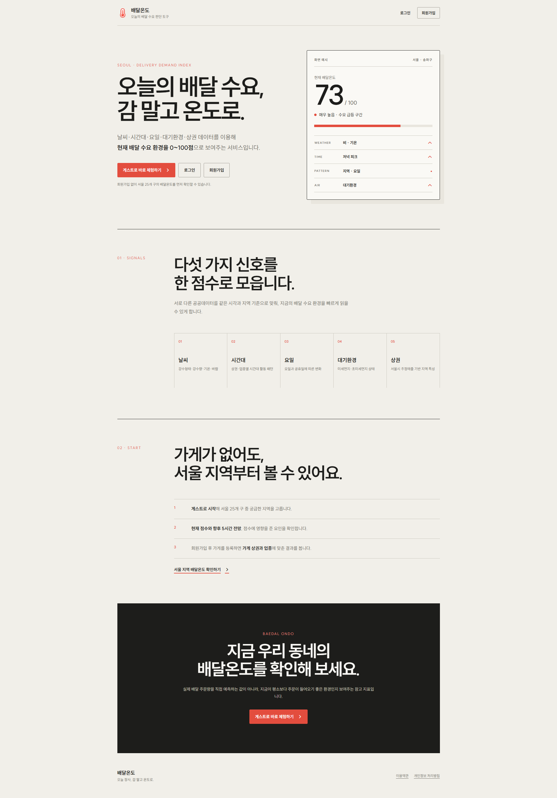
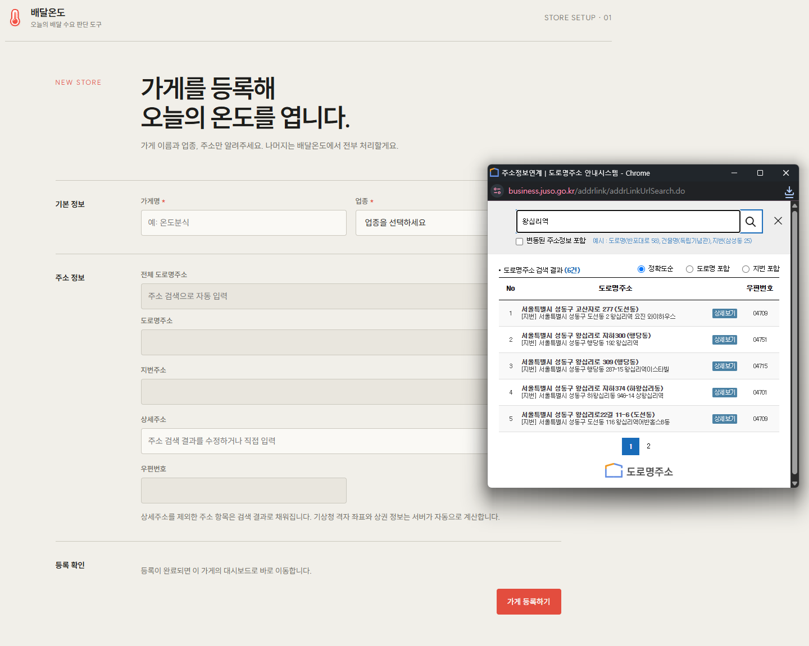
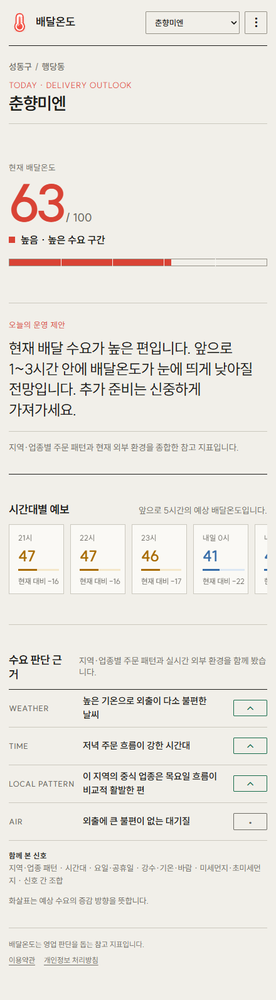
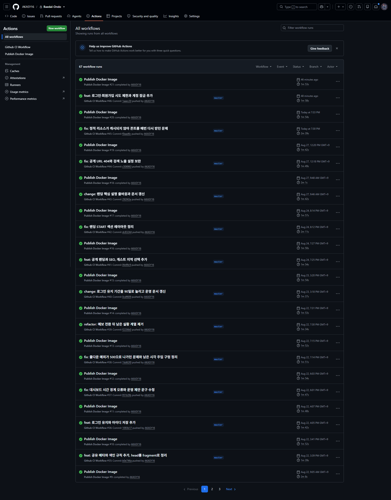
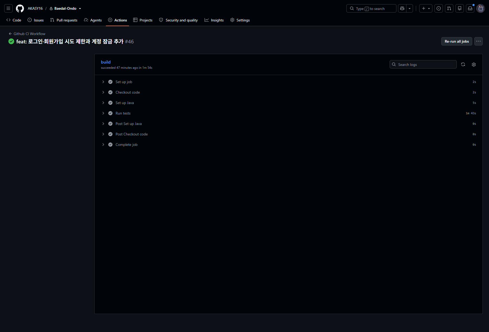
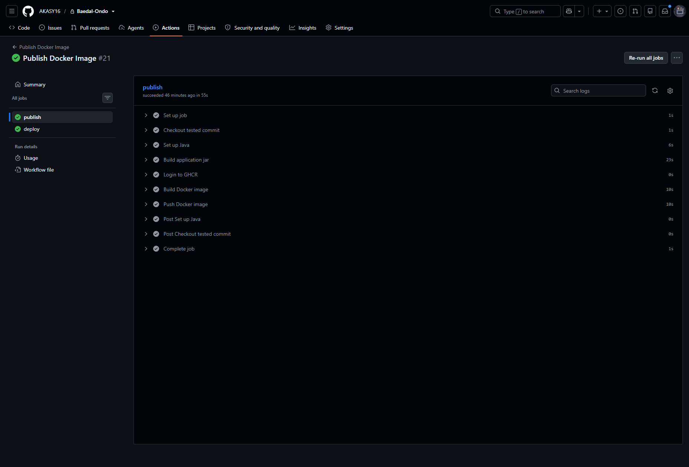
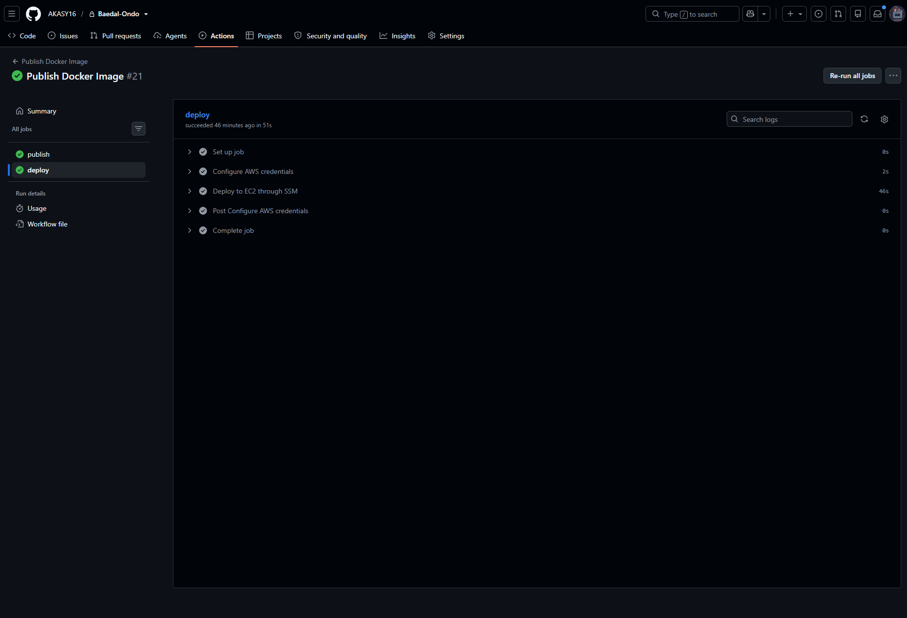

# 배달온도 BaedalOndo

서울 지역 매장의 현재부터 5시간 뒤까지 배달 수요 환경을 0~100점으로 보여주는 Spring Boot 프로젝트입니다.

매장 주소로 서울시 상권을 찾고, 상권·업종별 시간대/요일 패턴에 기상청 시간별 예보와 대기질을 더해 점수를 계산합니다.

실제 배달 주문량을 직접 예측하는 모델은 아닙니다. 서울시 상권분석서비스의 추정매출과 공공데이터를 이용해, 지금이 평소보다 주문이 들어오기 좋은 조건인지 빠르게 볼 수 있도록 만든 지표입니다.

운영 서비스: [www.baedalondo.com](https://www.baedalondo.com)



현재 점수와 그 점수가 나온 이유, 그리고 앞으로 5시간의 전망을 한 화면에서 봅니다.

---

## 핵심 구현

이 프로젝트에서 단순 CRUD보다 더 많이 고민했던 부분들입니다.

| 주제 | 구현 |
| --- | --- |
| **상권·업종별 수요 패턴** | 서울시 추정매출(2023~2025)을 오프라인 전처리해 `DayWeight`, `TimeWeight` 생성. 상권 데이터가 없을 때는 서울 전체 업종 평균으로 fallback |
| **현재 + 5시간 전망** | 현재 시각과 이후 5시간을 같은 계산 규칙으로 산출. 가까운 1~3시간의 상승·하락 폭을 대시보드 안내 문구에 반영 |
| **외부 API 장애 대응** | AirKorea 응답 시간을 직접 측정한 뒤 timeout 연장 대신 **즉시 재시도 1회 + 60초 실패 쿨다운** 적용. 서버 기동 시 공휴일·대기질·예보도 미리 적재 |
| **운영 DB와 같은 테스트 환경** | H2에서는 MySQL용 Flyway migration이 검증되지 않는 문제가 있어 Testcontainers MySQL로 교체. 테스트에서도 V1부터 migration 후 `ddl-auto: validate` 수행 |
| **주소에서 상권까지 연결** | 도로명주소 좌표 → WGS84 → JTS 기반 서울시 상권 GeoJSON 판별 → `commercialAreaCode` 저장. 같은 주소에서 기상청 격자 `nx`, `ny`도 계산 |
| **운영 배포 자동화** | CI를 통과한 커밋만 GHCR에 이미지로 게시하고, GitHub Actions가 AWS OIDC와 SSM으로 EC2에 배포한 뒤 health check 확인 |

아래에서 각 부분의 계산 방식과 문제 해결 과정을 조금 더 자세히 설명합니다.

---

## 서비스 흐름

```text
매장 주소
   │
   ├─ 도로명주소 좌표 API
   │      ├─ WGS84 좌표
   │      └─ 기상청 nx, ny
   │
   └─ 서울시 상권 GeoJSON + JTS
          └─ commercialAreaCode

commercialAreaCode + businessType
   │
   ├─ TimeWeight
   └─ DayWeight

기상청 초단기예보 ─┐
AirKorea 대기질 ───┼─> ScoreService ─> DashboardView ─> Thymeleaf
공휴일 정보 ───────┘
```

외부 데이터는 요청할 때마다 새로 받지 않습니다. 같은 기준시각의 값이 DB에 있으면 저장된 값을 재사용하고, 없을 때만 외부 API를 호출합니다.

---

## 주요 기능

### 공개 랜딩



- `/` 첫 화면에서 데이터 근거와 0~100점 지표의 의미를 두 줄로 나눠 설명
- 게스트 대시보드, 로그인, 회원가입으로 이어지는 공개 진입 경로
- `01 · SIGNALS`, `02 · START`가 같은 제목 기준선을 사용하는 responsive 구성
- canonical, Open Graph, WebSite JSON-LD, 검색 설명문과 네이버 사이트 소유확인 메타 제공
- 절대 URL favicon과 `Content-Language: ko-KR`로 검색엔진에 사이트·문서 언어를 일관되게 전달
- 로그인·회원가입·동적 게스트 대시보드는 `noindex`, 검색 가치가 있는 정적 공개 페이지만 sitemap에 포함

### 매장 등록



주소를 고르면 나머지 주소 항목이 채워지고, 기상청 격자 좌표와 상권 코드는 서버가 계산합니다.

- 도로명주소 검색 팝업 연동
- 주소 기반 기상청 격자 좌표 `nx`, `ny` 계산
- WGS84 좌표와 서울시 상권 GeoJSON을 이용한 `commercialAreaCode` 판별
- 업종을 `BusinessType` Enum 9종으로 관리
- 로그인 사용자의 소유 Store만 조회/수정

### 대시보드



가게에서 폰으로 보는 화면입니다. 시간대별 예보는 좁은 화면에서 가로로 넘겨 봅니다.

- 현재 배달온도 점수와 상태 표시
- 현재 시각부터 5시간 뒤까지 시간별 배달온도 표시
- 가까운 1~3시간의 상승·하락 전망을 현재 상태 문구에 반영
- 시간대, 요일/공휴일, 날씨, 대기질이 점수에 준 영향 표시
- 게스트는 서울 25개 구 중 지역을 직접 선택
- 등록 매장 드롭다운 전환
- 비로그인 사용자와 등록 매장이 없는 사용자를 위한 게스트 대시보드

### 외부 데이터

- 기상청 초단기예보: `PTY`, `RN1`, `T1H`, `REH`, `WSD`
- AirKorea: PM10, PM2.5
- 공공데이터포털 특일정보: 공휴일
- 외부 API 실패 시 해당 요인만 제외하고 대시보드는 계속 표시
- 서버 기동 직후 공휴일, 대기질, 예보 사전 적재

### 인증

- Spring Security 기반 로그인/로그아웃
- 로그인 유지(90일)와 브라우저 로컬 저장소 기반 아이디 저장
- 회원가입 및 아이디 중복 검사
- 가입 시 약관·개인정보·연령·광고성 이메일 동의 시각/문서 버전 저장
- 비밀번호 재확인 후 계정·매장·동의 이력 삭제
- 사용자 소유 Store만 접근 가능

---

## 점수 계산

배달온도는 50점을 기준으로 각 요인의 기여도를 더한 뒤 0~100 범위로 제한합니다.

```text
score = 50
      + 시간대 기여도
      + 요일/공휴일 기여도
      + 날씨 기여도
      + 대기질 기여도
      + 상호작용 보너스
```

| 요인 | 반영 방식 | 범위 |
| --- | --- | ---: |
| 시간대 | 상권 x 업종 x `TimeWeight` | -12 ~ +14 |
| 요일 | 상권 x 업종 x `DayWeight` | -6 ~ +6 |
| 공휴일 | 고정 가중치 | +8 |
| 날씨 | 강수량, 강수형태, 기온, 풍속 | 0 ~ +20 |
| 대기질 | PM10, PM2.5 | 0 ~ +8 |
| 상호작용 | 피크 시간, 양수 DayWeight, 비, 공휴일 조합 | 0 ~ +10 |

### 시간대 가중치

서울시 상권분석서비스의 6개 시간 구간별 매출건수를 그대로 비교하면 구간 길이가 달라 왜곡이 생깁니다.

그래서 각 구간의 매출건수를 구간 길이로 나눈 뒤, 같은 상권·업종의 24시간 평균 시간당 활동량을 100으로 둔 `TimeIndex`를 만들었습니다.

```text
commercialAreaCode + businessType + 시간대
    -> Local TimeWeight

없으면 businessType + 시간대
    -> City TimeWeight

업종이 없는 게스트
    -> 공통 시간표
```

사용하는 시간 구간은 다음과 같습니다.

```text
00~06
06~11
11~14
14~17
17~21
21~24
```

등급별 최종 기여도:

```text
CLOSED     -12
LOW         -6
MEDIUM       0
HIGH        +8
VERY_HIGH  +14
```

서울시 원본은 배달 주문 데이터가 아니라 추정매출 데이터입니다. 따라서 `TimeWeight`를 주문량 자체로 해석하지 않고, 해당 상권·업종이 어느 시간대에 활발한지를 나타내는 보조 지표로 사용합니다.

전처리 과정은 [`data-processing/README.md`](data-processing/README.md)에 따로 정리했습니다.

### 요일 가중치

요일 이름에 고정 점수를 주는 대신 상권·업종별 `DayWeight`를 사용합니다.

예를 들어 같은 일요일이라도 오피스 상권 카페와 주거 상권 카페의 값이 다르게 나올 수 있습니다.

```text
commercialAreaCode + businessType + 요일
    -> Local DayWeight

없으면 businessType + 요일
    -> City DayWeight

그래도 없으면
    -> 0
```

공휴일 효과는 원본 데이터에서 따로 분리할 수 없어서 공휴일에는 `DayWeight` 대신 +8을 사용합니다.

피크 시간대이고 `DayWeight > 0`인 경우에는 다음 값을 최대 +3까지 추가합니다.

```text
ceil(DayWeight / 2)
```

음수인 요일과 공휴일에는 이 보너스를 적용하지 않습니다.

### 점수 구간

| 점수 | 상태 |
| --- | --- |
| 0~36 | 매우 낮음 · 한산한 수요 구간 |
| 37~41 | 낮음 · 수요 둔화 구간 |
| 42~55 | 보통 · 평균 수요 구간 |
| 56~63 | 높음 · 높은 수요 구간 |
| 64~100 | 매우 높음 · 수요 급등 구간 |

20점 단위로 나누면 계산 가능한 최저점이 32라 최하단 구간이 사실상 나오지 않고, 맑은 날에는 80점 이상도 나오지 않았습니다. 그래서 `simulate_score_distribution.py`로 만든 맑은 날 분포를 기준으로 경계를 다시 잡았습니다. 악천후는 실제 가산 요인이므로 평범한 날보다 높은 구간으로 이동하도록 그대로 둡니다.

상호작용 보너스는 최종 점수에는 포함하지만 대시보드에 별도 항목으로 노출하지 않습니다. 화면에서는 시간대, 요일/공휴일, 날씨, 대기질이 점수에 영향을 준 방향만 보여줍니다.

---

## 기술적으로 고민했던 부분

### 1. 외부 API timeout을 늘리지 않고 재시도와 쿨다운을 넣은 이유

서버를 한동안 내려뒀다가 다시 켜면 첫 대시보드 요청에서 대기질이 빠지는 경우가 있었습니다. 로그에는 timeout이 남았지만 새로고침을 몇 번 하면 다시 정상적으로 나왔습니다.

처음에는 fallback 구조를 의심했지만, 재시도를 넣기 전에 AirKorea 응답 시간을 먼저 확인했습니다.

```bash
python data-processing/probe_airkorea_latency.py
```

같은 요청을 72회 보낸 결과:

| 결과 | 응답 시간 |
| --- | --- |
| 성공 | 대부분 137~330ms |
| 실패 | 5,050 / 10,400 / 12,830ms 뒤 HTTP 504 |

성공하는 요청은 이미 4초 안에 들어왔고, 실패하는 요청만 5초 이상 붙잡혀 있었습니다. 이 패턴에서는 read timeout을 10초로 늘려도 새로 성공할 요청은 거의 없고 실패를 더 오래 기다리게 됩니다.

반대로 실패 직후 바로 한 번 더 호출했을 때는 성공하는 경우가 있었습니다.

4초 timeout으로 15회 확인했을 때:

```text
첫 호출만 사용          40%
실패 시 1회 재시도 포함 80%
```

그래서 `ExternalCallGuard`에서 다음 경우에만 바로 한 번 더 호출하도록 했습니다.

```text
connection timeout
read timeout
HTTP 502
HTTP 503
HTTP 504
```

여기에 재시도만 추가하면 장애가 길어질 때 호출량이 두 배가 됩니다. 실패한 응답은 DB에 저장하지 않기 때문에 사용자가 새로고침할 때마다 다시 외부 호출 분기로 들어가기 때문입니다.

그래서 두 번 모두 실패한 대상은 60초 동안 다시 호출하지 않도록 쿨다운을 함께 넣었습니다.

장애 상태에서 확인한 결과:

```text
1) 첫 요청       4,626ms   두 번 시도 후 실패, 대기질 없이 표시
2) 바로 다음         75ms   외부 호출 생략, 같은 결과
3) 또 다음           68ms   외부 호출 생략, 같은 결과
4) 60초 뒤       4,073ms   쿨다운 해제 후 다시 호출
```

쿨다운은 결과를 바꾸는 기능이 아니라, 같은 실패를 매 요청마다 다시 기다리지 않게 하는 장치입니다.

서버가 다시 올라온 직후 캐시가 비어 있는 구간도 따로 처리했습니다. `ApplicationReadyEvent`에서 기존 preload 로직을 한 번 실행해 공휴일, 대기질, 예보를 먼저 채웁니다. preload가 실패해도 서버 기동 자체는 막지 않습니다.

확인 당시 기동 직후 공휴일 61행과 예보 96행이 적재됐고, 게스트 대시보드는 첫 요청 약 984ms, 이후 요청은 60ms대로 내려갔습니다.

---

### 2. H2 테스트를 Testcontainers MySQL로 바꾼 이유

처음에는 테스트 DB로 H2를 사용했습니다.

문제는 운영 스키마가 MySQL 기준이라는 점이었습니다. 초기 migration에는 다음과 같은 MySQL 문법이 들어갑니다.

```text
ENUM
ENGINE=InnoDB
BIT(1)
```

H2에서는 V1을 그대로 실행할 수 없어 테스트에서 Flyway를 끄고 Hibernate `create-drop`으로 스키마를 만들었습니다.

테스트는 통과했지만, 정작 실제 배포에서 실행되는 Flyway migration은 CI에서 한 번도 실행되지 않는 상태였습니다.

그래서 테스트 DB도 MySQL로 맞췄습니다.

```text
Testcontainers MySQL
        │
        v
Flyway V1 -> 최신 migration
        │
        v
Hibernate ddl-auto: validate
        │
        v
Spring context load
```

`BaedalOndoApiApplicationTests`에서 이 경로를 확인합니다.

migration에 일부러 문법 오류를 넣으면 컨텍스트 로드 단계에서 테스트가 실패하는 것도 확인했습니다. 지금은 엔티티 테스트뿐 아니라 실제 migration 파일도 배포 전에 한 번 실행됩니다.

Testcontainers 컨테이너는 `MySqlTestSupport`에서 static으로 관리해 테스트 JVM 전체에서 공유합니다.

---

### 3. 주소 검색 팝업 때문에 일부 화면만 CSRF 예외로 둔 이유

도로명주소 팝업은 외부 도메인인 `business.juso.go.kr`에서 선택 결과를 애플리케이션 화면으로 POST합니다.

이 요청에는 우리 애플리케이션의 CSRF 토큰을 넣을 수 없기 때문에 결과를 받는 두 경로는 CSRF 예외입니다.

```text
/store/register
/store/*/edit
```

두 경로는 화면을 다시 렌더링할 뿐 Store 데이터를 직접 변경하지 않습니다.

실제 등록과 수정을 처리하는 `/api/stores`는 CSRF 보호를 유지하고, 화면에서 `<meta name="_csrf">` 값을 읽어 요청 헤더에 담습니다.

---

### 4. 유니크 충돌을 락 대신 재조회로 처리한 이유

날씨와 대기질은 모두 같은 순서로 동작합니다.

```text
① 저장된 값이 있는지 조회
② 없으면 외부 API 호출
③ 받아온 값을 저장
```

①과 ③ 사이에 간격이 있어서, 같은 격자나 시도를 동시에 처음 조회하면 두 요청이 모두 ①에서 빈 결과를 보고 ③까지 들어갑니다. 먼저 저장한 쪽은 성공하고 나중 쪽은 유니크 제약에 걸립니다.

```text
uk_forecast_weather_record     (nx, ny, base_date, base_time, forecast_at)
uk_current_air_quality_record  (sido_name, district_name, station_name, measured_at)
```

캐시가 비어 있는 순간에만 발생하기 때문에 평소에는 드러나지 않습니다. 다만 그 순간이 언제인지는 정해져 있습니다. 서버를 새로 띄운 직후, 발표 시각이나 기준 시각이 넘어가는 시점, 그리고 preload 스케줄러와 사용자 요청이 겹치는 시점입니다.

락을 잡거나 `INSERT ... ON DUPLICATE KEY UPDATE`로 바꾸는 방법도 있지만, 여기서는 두 요청이 같은 발표분을 저장하려는 것이라 어느 쪽이 저장해도 결과가 같습니다. 충돌했다는 것 자체가 다른 요청이 이미 저장했다는 뜻이므로, 조회부터 다시 하면 이번에는 그 값이 보입니다.

```java
try {
    return loadOrFetchOnce(nx, ny);
} catch (DataIntegrityViolationException e) {
    return loadOrFetchOnce(nx, ny);
}
```

다시 조회할 때는 외부 API를 호출하지 않습니다. 첫 분기에서 먼저 저장된 값이 보이고 거기서 끝나기 때문입니다.

재시도는 한 번만 합니다. 두 번째에도 충돌한다면 동시성이 아니라 다른 원인이므로 예외를 그대로 올립니다.

---

## 기술 스택

| 구분 | 사용 기술 |
| --- | --- |
| Language | Java 17, Python 3 |
| Framework | Spring Boot 4.0.7, Spring Web MVC, Spring Security |
| View | Thymeleaf |
| Persistence | Spring Data JPA, MySQL 8, Flyway |
| Spatial | PROJ4J, JTS Topology Suite |
| Test | JUnit 5, Mockito, Testcontainers |
| Build / Infra | Gradle, Docker, Docker Compose, GitHub Actions |
| ETC | Lombok |

Python은 서울시 추정매출 데이터를 `DayWeight`, `TimeWeight`로 전처리하는 오프라인 작업에만 사용합니다.

---

## 프로젝트 구조

```text
src/main/java/com/baedalondo/api
├── airquality      # AirKorea API, 대기질 기록/점수
├── auth            # 로그인, 현재 사용자, UserDetailsService
├── commercialarea  # GeoJSON 로딩, 좌표 기반 상권 판별
├── config          # Security, RestClient 등 공통 설정
├── dashboard       # 대시보드 화면, DashboardView 조립
├── guest           # 게스트 지역 로딩/조회
├── home            # 공개 랜딩페이지
├── holiday         # 공휴일 API, 저장/조회
├── location        # 주소 좌표, 기상청 격자 변환
├── legal           # 약관, 개인정보 처리방침
├── score           # 최종 점수, DayWeight/TimeWeight
├── store           # Store, 매장 등록/수정
├── user            # UserAccount
└── weather         # 기상청 API, 날씨 기록/점수

data-processing/
└── ...             # 추정매출 -> DayWeight/TimeWeight 전처리
```

---

## 실행

### 필요한 환경

- Java 17
- MySQL 8 또는 Docker
- 외부 API 키

API 키와 DB 비밀번호, 로그인 유지 서명 키는 설정 파일에 저장하지 않고 환경변수로 받습니다.

| 환경변수 | 용도 | 필수 |
| --- | --- | --- |
| `KMA_AUTH_KEY` | 기상청 초단기예보 | O |
| `DATAPORTAL_AUTH_KEY` | AirKorea, 공휴일 | O |
| `JUSO_SEARCH_AUTH_KEY` | 도로명주소 검색·서버 검증 | O |
| `JUSO_COORDINATE_AUTH_KEY` | 도로명주소 좌표제공 | O |
| `REMEMBER_ME_KEY` | 로그인 유지 토큰 서명 키(32자 이상의 랜덤 문자열) | O |
| `DATAPORTAL_HOLIDAY_AUTH_KEY` | 공휴일 전용 키 | 선택 |
| `JUSO_POPUP_AUTH_KEY` | 도로명주소 팝업 | 선택 |

`DATAPORTAL_HOLIDAY_AUTH_KEY`가 없으면 `DATAPORTAL_AUTH_KEY`를 사용합니다.  
`JUSO_POPUP_AUTH_KEY`의 기본값은 `TESTJUSOGOKR`입니다.

### Docker Compose

프로젝트 루트에 `.env`를 만듭니다.

```text
DB_USERNAME=baedalondo_app
DB_PASSWORD=앱_계정_비밀번호
DB_ROOT_PASSWORD=컨테이너_root_비밀번호
REMEMBER_ME_KEY=openssl_rand_-base64_48_명령으로_생성한_값을_입력하세요

KMA_AUTH_KEY=기상청_API_KEY
DATAPORTAL_AUTH_KEY=공공데이터포털_API_KEY
DATAPORTAL_HOLIDAY_AUTH_KEY=공휴일_API_KEY
JUSO_SEARCH_AUTH_KEY=도로명주소_검색_API_KEY
JUSO_COORDINATE_AUTH_KEY=도로명주소_좌표제공_API_KEY
JUSO_POPUP_AUTH_KEY=도로명주소_팝업_API_KEY
```

`.env`는 `.gitignore`에 포함되어 있습니다.

```bash
./gradlew build
docker compose up -d --build
```

Windows:

```bash
./gradlew.bat build
docker compose up -d --build
```

로그/상태 확인:

```bash
docker compose ps
docker compose logs -f app
```

종료:

```bash
docker compose down
```

볼륨까지 삭제:

```bash
docker compose down -v
```

> `docker compose down -v`는 MySQL 데이터도 삭제합니다.

<details>
<summary><strong>로컬 MySQL로 실행</strong></summary>

MySQL 8에 DB와 계정을 만듭니다.

```sql
CREATE DATABASE baedalondo
    CHARACTER SET utf8mb4
    COLLATE utf8mb4_unicode_ci;

CREATE USER 'baedalondo_app'@'localhost'
    IDENTIFIED BY '비밀번호';

GRANT ALL PRIVILEGES
    ON baedalondo.*
    TO 'baedalondo_app'@'localhost';

FLUSH PRIVILEGES;
```

DB 설정:

| 환경변수 | 기본값 |
| --- | --- |
| `DB_URL` | `jdbc:mysql://localhost:3306/baedalondo` |
| `DB_USERNAME` | `baedalondo_app` |
| `DB_PASSWORD` | 없음 |

실행:

```bash
./gradlew bootRun
```

Windows:

```bash
./gradlew.bat bootRun
```

SQL과 바인딩 값을 확인할 때는 `local` 프로필을 사용합니다.

```bash
SPRING_PROFILES_ACTIVE=local ./gradlew bootRun
```

운영 환경에서는 `local` 프로필을 사용하지 않습니다.

</details>

### 운영 배포

`master` push가 CI를 통과하면 같은 커밋으로 실행 jar와 Docker 이미지를 만듭니다.

```text
GitHub Actions CI 성공
        │
        v
GHCR 이미지 게시 (latest + commit SHA)
        │
        v
AWS OIDC 역할 수임
        │
        v
SSM으로 EC2 배포
        │
        v
/actuator/health 확인
```

EC2에서는 Gradle 빌드를 하지 않고 검증된 이미지만 받습니다. 앱 포트는 `127.0.0.1:8080`에만 열고, 외부 요청은 Cloudflare와 Nginx를 거쳐 전달합니다.



커밋을 밀면 테스트, 이미지 게시, 배포가 차례로 돕니다. 테스트가 통과한 커밋만 이미지가 되고, 그 이미지가 그대로 서버에 올라갑니다.

<details>
<summary><strong>단계별 실행 화면</strong></summary>

테스트. Testcontainers가 MySQL을 띄우고 Flyway migration까지 실제로 실행합니다.



이미지 게시. 테스트를 통과한 커밋을 다시 받아 jar를 만들고 GHCR에 올립니다.



배포. AWS OIDC로 역할을 수임하고 SSM으로 EC2에서 배포 명령을 실행합니다. 장기 자격증명을 두지 않습니다.



</details>

현재 배포 명령은 app 컨테이너를 `--force-recreate`하므로 교체와 JVM 기동 사이에 짧은 중단이 있습니다. 10초 간격 외부 관측에서 502가 두 번 연속 확인돼 실제 중단은 10~30초로 추정합니다. 정확한 초 단위 측정과 blue-green 전환은 인스턴스를 늘리는 시점에 함께 진행합니다.

---

## 테스트

```bash
./gradlew test
```

Windows:

```bash
./gradlew.bat test
```

테스트에는 실제 API 키나 `DB_PASSWORD`가 필요하지 않습니다.

`src/test/resources/application.yaml`의 더미 API 키를 사용하고, DB는 Testcontainers가 MySQL 8 컨테이너를 띄웁니다.

**Docker는 실행 중이어야 합니다.**

테스트에서도 운영과 마찬가지로 Flyway migration을 적용하고 Hibernate는 `ddl-auto: validate`로 스키마를 검사합니다.

---

## 주요 URL

| URL | 용도 | 로그인 |
| --- | --- | --- |
| `/` | 서비스 소개와 공개 진입 랜딩페이지 | 불필요 |
| `/dashboard/main` | 로그인 사용자 대시보드 | 필요 |
| `/dashboard/main/{storeId}` | 매장 선택 | 필요 |
| `/store/register` | 매장 등록 | 필요 |
| `/store/{storeId}/edit` | 매장 수정 | 필요 |
| `/api/stores` | 매장 등록 API | 필요 |
| `/api/stores/{storeId}` | 매장 수정 API | 필요 |
| `/guest` | 게스트 모드 진입 | 불필요 |
| `/dashboard/guest` | 게스트 대시보드, `regionId`로 서울 25개 구 선택 | 불필요 |
| `/login` | 로그인 | 불필요 |
| `/signup` | 회원가입 | 불필요 |
| `/terms` | 이용약관 | 불필요 |
| `/privacy` | 개인정보 처리방침 | 불필요 |
| `/actuator/health` | 헬스체크 | 불필요 |

`/dashboard/main/{storeId}`는 Store ID를 세션에 저장한 뒤 `/dashboard/main`으로 리다이렉트합니다.

---

## 매장 등록 API

```http
POST /api/stores
Content-Type: application/json
```

```json
{
  "name": "온도분식",
  "businessType": "BUNSIK",
  "jusoAddress": {
    "roadFullAddr": "서울특별시 송파구 ...",
    "roadAddrPart1": "서울특별시 송파구 ...",
    "roadAddrPart2": "",
    "addrDetail": "101호",
    "jibunAddr": "서울특별시 송파구 ...",
    "zipNo": "00000",
    "siNm": "서울특별시",
    "sggNm": "송파구",
    "emdNm": "잠실동",
    "admCd": "1171010100",
    "rnMgtSn": "117103123001",
    "bdMgtSn": "1171010100100000000000001",
    "rn": "올림픽로",
    "udrtYn": "0",
    "buldMnnm": "300",
    "buldSlno": "0"
  }
}
```

응답:

```json
1
```

허용하는 `businessType`:

```text
KOREAN_FOOD
CHINESE_FOOD
JAPANESE_FOOD
WESTERN_FOOD
CHICKEN
FAST_FOOD
BUNSIK
CAFE_BEVERAGE
BAKERY
```

---

## 운영 메모

### 외부 API timeout

`RestClientConfig`에서 공통으로 다음 값을 사용합니다.

```text
connect timeout: 2s
read timeout:    4s
```

재시도 대상은 connect/read timeout과 HTTP 502, 503, 504입니다.

두 번 모두 실패한 대상은 60초 동안 외부 호출을 생략합니다. 쿨다운 중에 시간 조건 없는 오래된 측정값을 현재 값처럼 대신 반환하지는 않습니다.

### Health check

```bash
curl http://localhost:8080/actuator/health
```

외부에 노출하는 actuator endpoint는 `health`만 사용하고, `show-details: never`로 내부 상세정보는 응답에 포함하지 않습니다.

### DB 접속

DB 컨테이너의 3306 포트는 호스트에 공개하지 않습니다.

```bash
docker compose exec db mysql -u root -p baedalondo
```

### 백업 / 복구

```bash
./scripts/backup-db.sh
./scripts/restore-db.sh <백업파일.sql.gz>
```

스크립트는 컨테이너 내부의 `MYSQL_USER`, `MYSQL_PASSWORD`를 사용하므로 DB 비밀번호를 명령행 인자로 넘기지 않습니다.

| 환경변수 | 기본값 |
| --- | --- |
| `BACKUP_DIR` | `/var/backups/baedalondo` |
| `RETENTION_DAYS` | `14` |
| `DB_SERVICE` | `db` |
| `FORCE` | 없음 |

덤프에는 `--single-transaction`, `--no-tablespaces`를 사용합니다.

백업 성공 여부는 파일 크기뿐 아니라 `-- Dump completed` 표식도 확인합니다. `flyway_schema_history`도 같이 백업되므로 복구 뒤 적용된 migration을 다시 실행하지 않고 `validate`합니다.

크론 예시:

```bash
0 4 * * * /home/ubuntu/baedal-ondo-api/scripts/backup-db.sh >> /var/log/baedalondo-backup.log 2>&1
```

현재 백업은 서버 로컬 디스크에 남습니다. 서버 디스크 자체가 유실되는 경우를 대비한 외부 저장소 2차 복사는 배포 단계에서 추가할 예정입니다.

<details>
<summary><strong>복구 절차 테스트</strong></summary>

별도 compose project를 사용하면 실제 서비스 볼륨과 분리해서 복구를 확인할 수 있습니다.

```bash
export COMPOSE_PROJECT_NAME=baedalondo-restoretest

docker compose up -d db app
BACKUP_DIR=./build/backup-test ./scripts/backup-db.sh

docker compose down -v
docker compose up -d db

FORCE=1 ./scripts/restore-db.sh ./build/backup-test/<파일>.sql.gz
docker compose up -d app

docker compose down -v
```

</details>

---

## 기타 트러블슈팅

<details>
<summary><strong>환경변수 누락이 MySQL 비밀번호 오류로 보이는 경우</strong></summary>

터미널에서 다음 오류가 나지만 IDE에서는 정상 실행되는 경우가 있었습니다.

```text
java.sql.SQLException:
Access denied for user 'baedalondo_app'@'localhost'
(using password: YES)
```

원인은 IDE 실행 구성에만 `DB_PASSWORD`가 있고 터미널 환경에는 값이 없던 것이었습니다.

```yaml
password: "${DB_PASSWORD}"
```

플레이스홀더가 해결되지 않은 상태에서 `${DB_PASSWORD}` 문자열 자체가 MySQL에 전달돼 인증 오류로 보였습니다.

사용자 환경변수로 등록한 뒤 터미널과 IDE를 다시 시작해 해결했습니다.

</details>

<details>
<summary><strong>404 대신 로그인 화면이 표시되는 경우</strong></summary>

비로그인 상태에서 없는 URL에 접근했을 때 404 화면 대신 로그인 화면으로 이동했습니다.

모든 미분류 요청을 인증 대상으로 두면 컨트롤러 매핑이 없는 URL도 MVC의 404 처리보다 먼저 로그인 진입점에 걸립니다.

공개 URL과 로그인 보호 경로군을 명시하고, 그 어디에도 속하지 않는 익명 요청은 404로 응답하게 했습니다.
`/dashboard/**`, `/store/**`, `/api/**`, `/account/**`는 계속 로그인으로 보내며 `/error`의 `ERROR` dispatch는 허용합니다.

</details>

---

## 현재 범위

현재 구현되어 있는 범위:

- 매장 등록/수정과 사용자 소유권 검증
- 로그인/로그아웃, 로그인 유지, 아이디 저장, 회원가입, 회원 탈퇴
- 공개 랜딩페이지와 SEO 메타·WebSite JSON-LD·robots·sitemap
- 게스트 대시보드
- 서울 25개 구 게스트 지역 선택
- 주소 기반 기상청 격자/상권 판별
- 서울시 추정매출 기반 `DayWeight`, `TimeWeight`
- 기상청 초단기예보/AirKorea/공휴일 API 연동
- 현재 시각과 향후 5시간 점수, 가까운 1~3시간 전망 문구
- 외부 데이터 DB 재사용, 기동 preload, 재시도/쿨다운
- 가중치 기반 점수 계산과 영향 방향 표시
- Flyway migration
- Testcontainers MySQL 테스트
- Docker Compose
- GitHub Actions CI/CD, GHCR, AWS OIDC·SSM 기반 EC2 배포
- Nginx·Cloudflare·HTTPS 운영 경로
- DB 백업/복구

추가로 보강할 부분:

- 예보·대기질 캐시 테이블 보존 기간과 정리 정책
- 배포 중단 시간 정밀 측정과 인스턴스 증설 시 blue-green 전환
- 핵심 사용자 경로 브라우저 E2E와 운영 부하 테스트

현재 MVP에서는 별도 Store 목록 페이지와 `ScoreHistory` 기반 과거 비교 기능을 보류했습니다. 매장 전환은 대시보드 드롭다운으로 처리하고, 현재 버전은 과거 분석보다 **현재 점수, 그 점수가 나온 이유, 가까운 시간대의 전망**을 보여주는 데 집중합니다.
